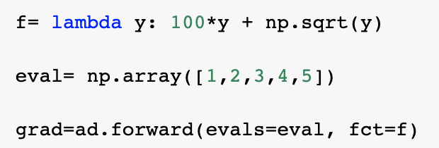

# Introduction

This package implements the automatic differentiation. This is important for complex computational problems, including optimization. 

# Background 

Automatic Differentiation is a set of techniques that executes a sequence of elementary arithmetic operations (addition, subtraction, multiplication, division, etc.) and elementary functions. AD applies the chain rule to these operations to compute derivatives of arbitrary order, which is when the order is a real rational, irrational, or complex number. AD is different from symbolic and numerical differentiation because it is more code efficient, can output a single expression, and does not have round-off errors in the discretization process/cancellation. AD is also popular because it can compute partial derivatives of functions with many inputs/independent variables, which is important for gradient-based optimization. The two forms of AD are the forward mode, where the chain rule is applied from inside to outside the given function/expression, while reverse mode goes from outside to inside.

Automatic Differentiation uses computational graphs, which are functional descriptions using nodes and edges to describe the given computation. Edges represent values like scalars, vectors, matrices, or tensors, while nodes represent functions whose inputs are the incoming edges and the outputs are the outcoming edges.Another feature of computational graphs are that they are directed, which allowsus to follow the order of the computation. For forward propagation computation, we compute the function from inside to outside. More specifically, both forward and reverse modes use the chain rule to calculate the gradients, and in forward mode, the gradients are computed in the same order as the function evaluation. 

The following is an example of a computational graph:

Source: https://kailaix.github.io/ADCME.jl/latest/tu_whatis/

# How to Use AutomaticDifferentiation

#### Installing the package

python3 -m pip install AutoDiff

#### Dependencies 

python3 -m pip install requirements.txt

#### Importing the package: 

import AutoDiff as ad

#### Examples:

For a scalar function: 

For a vector function:
Note: For now vector functions are not suported. This functionality will be soon implemented and an example will be given here.

# Software Organization

#### Directory Structure
Will be laid out as follows: 

#### Modules
**DualNum** module contains the class definition and methods for using dual numbers and hence using automatic differentiation.

#### Testing and Coverage
TravisCI will be used for managing the testing suite. CodeCov will ensure proper coverage for our source code.

#### Package Distribution
Package will be distributed with PyPI. We will create *pyproject.toml* and *setup.cfg* files and then use **build** to build and upload the project.

#### Package Framework
Since we don't have too many modules to work with and we aren't building any sort of application, a packaging framework won't be used to avoid overcomplicating development.

# Implementation 

#### Core data structure: 

We primarily used arrays when implementing the automatic differentiation for vector functions. We designed our own data structure in the package. It is composed of 4 classes: DualNum, DualNumVec, Node and NodeVec. We will describe the classes and their attributes in the following sections. Methods of each class will also be described. These 4 classes allow us to conduct both forward and reverse mode at the user's choice. 

#### Classes to implement: 

1. DualNum: Initiate a function variable for scalar inputs to calculate the value and derivative of a function in Forward Mode.  

2. DualNumVec: Initate a function variable for vector inputs to calculate the value and derivative of a function in Forward Mode.

3. Node:

4. NodeVec:

We overloaded all the basic operations, and created elemental functions as static methods. 

A snippet of the class structure is as follows:

#### Methods and name attributes: 

**Attributes:**

- `self.val`: stores the value of the DualNum object. In practice, this will be the value of a function 
- `self.der`: stores the derivative of the DualNum object. 

All the following methods are overwritten for members of the DualNum class: addition, multiplication, subtraction, division, power. In addition the following elementary functions are overwritten as well as staticmethods: exponential, logarithm, sine, cosine (tangent is sine over cosine). All of these methods also work with numbers which are upgraded to dual numbers when encountered as can be seen in the following example:

**Basic operations:**

- `__add__`: for addition.
- `__radd__`: for reverse addition.
- `__mul__`: for multiplication.
- `__rmul__`: for reverse multiplication.
- `__sub__`: for subtraction.
- `__rsub__`: for reverse subtraction.
- `__truediv__`: for division. 
- `__rtruedive__`: for reverse division. 
- `__neg__`: for negation.
- `__pow__`: for the power calculation.i.e. DualNum(1,1)^3. 
- `__rpow__`: for the reverse power calculation.i.e. 3^DualNum(1,1)

**Static methods:** for trigonometry operations as well as exponentials and ln operations. 

- `__sin__`
- `__cos__`
- `__tan__`
- `__sinh__`
- `__cosh__`
- `__tanh__`
- `__arcsin__`
- `__arccos__`
- `__arctan__`
- `__sqrt__`
- `__exp__`
- `__log__`

An example of the `__sin__` function is as follows:

 
 
#### External dependencies: 

We used **numpy** as the sole dependency package, because it is fast and offers powerful tools for mathematical operations. At this stage we do not require other dependencies such as simpy or scipy. 

#### Deal with elementary functions: 

We have desgined a **test_DualNum.py** file that achieved 96% of the code coverage. See below for the result. 

Some simple user cases for some methods: 

# Extension - Reverse Mode

#### Background
Our extension to the package is an implementation of reverse mode automatic differentiation. The primary difference between reverse mode and forward mode
is that reverse mode takes just 2 passes to compute the derivative for any function with any dimensions of input and output. Forward mode requires more 
and more passes to compute the full derivative of a function as dimensions are added, and this is because reverse mode will create the computational graph
in one pass and then work backwards in another pass to compute the whole derivative. Forward mode does not store the computational graph, and so it needs
to do the entire chain rule to compute a derivative for each possible "direction" given by a seed vector. Because of those, reverse mode is a much more
efficient method of automatic differentiation for functions with many dimensions of input, which is how neural networks operate. The tradeoff for this is
that reverse mode takes up much more memory as storing the whole computational graph is needed.

#### Implementation

# Licensing

MIT License

Copyright (c) [2021] [Jie Sun, Taro Johann Spirig, Zachary Brown, Hannah Phan] 
Permission is hereby granted, free of charge, to any person obtaining a copy
of this software and associated documentation files (the "Software"), to deal
in the Software without restriction, including without limitation the rights
to use, copy, modify, merge, publish, distribute, sublicense, and/or sell
copies of the Software, and to permit persons to whom the Software is
furnished to do so, subject to the following conditions:

The above copyright notice and this permission notice shall be included in all
copies or substantial portions of the Software.

THE SOFTWARE IS PROVIDED "AS IS", WITHOUT WARRANTY OF ANY KIND, EXPRESS OR
IMPLIED, INCLUDING BUT NOT LIMITED TO THE WARRANTIES OF MERCHANTABILITY,
FITNESS FOR A PARTICULAR PURPOSE AND NONINFRINGEMENT. IN NO EVENT SHALL THE
AUTHORS OR COPYRIGHT HOLDERS BE LIABLE FOR ANY CLAIM, DAMAGES OR OTHER
LIABILITY, WHETHER IN AN ACTION OF CONTRACT, TORT OR OTHERWISE, ARISING FROM,
OUT OF OR IN CONNECTION WITH THE SOFTWARE OR THE USE OR OTHER DEALINGS IN THE
SOFTWARE.

# Feedback
More specifically, 
a) in the background section, it will be helpful to add some information about computational graphs and how they are used in AD. 

Implemented feedback: We included an explanation for the application of computational graphs in automatic differentiation, as well as embedded images for the chain rule and an example computational graph.

b) In "how to use" I would add some information about how this package can be downloaded/installed, and some more detailed demo examples of you creating some scalar/vector functions, and getting their values and derivatives. 

Implemented feedback: We explained how to install the package, import the package, and gave an example of the use case for forward mode (a scalar and vector function).

c) In implementation details, I would consider some of the elementary functions that you would add (like __add__, sin, __mul__, etc.), and have either a short description for all of them, or some basic pseudocode for one or two of them.

Implemented feedback: We provided examples of specific elementary functions, how we would implement dual numbers, and then some pseudocode for it. 
