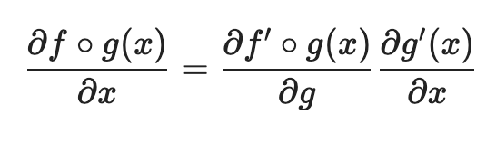
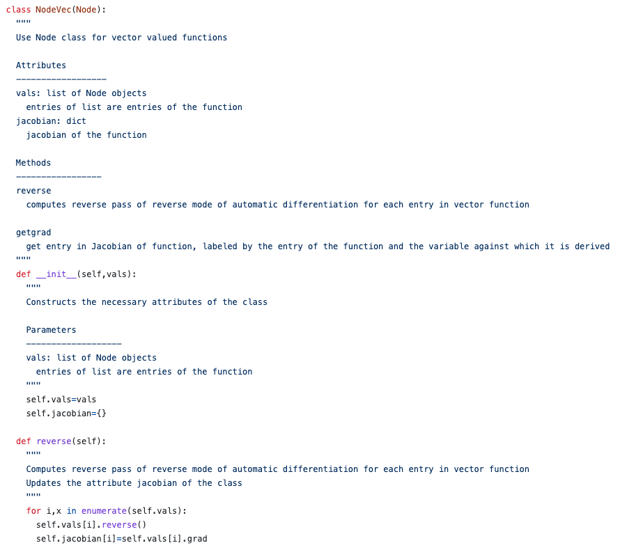

# Introduction

This package implements the automatic differentiation. This is important for complex computational problems, including optimization. 

# Background 

Automatic Differentiation is a set of techniques that executes a sequence of elementary arithmetic operations (addition, subtraction, multiplication, division, etc.) and elementary functions. AD applies the chain rule to these operations to compute derivatives of arbitrary order, which is when the order is a real rational, irrational, or complex number. AD is different from symbolic and numerical differentiation because it is more code efficient, can output a single expression, and does not have round-off errors in the discretization process/cancellation. AD is also popular because it can compute partial derivatives of functions with many inputs/independent variables, which is important for gradient-based optimization. The two forms of AD are the forward mode, where the chain rule is applied from inside to outside the given function/expression, while reverse mode goes from outside to inside.

Automatic Differentiation uses computational graphs, which are functional descriptions using nodes and edges to describe the given computation. Edges represent values like scalars, vectors, matrices, or tensors, while nodes represent functions whose inputs are the incoming edges and the outputs are the outcoming edges.Another feature of computational graphs are that they are directed, which allowsus to follow the order of the computation. For forward propagation computation, we compute the function from inside to outside. More specifically, both forward and reverse modes use the chain rule to calculate the gradients, and in forward mode, the gradients are computed in the same order as the function evaluation. 

The following is an example of a computational graph:

Source: https://kailaix.github.io/ADCME.jl/latest/tu_whatis/

#### Extension - Reverse Mode
Our extension to the package is an implementation of reverse mode automatic differentiation. The primary difference between reverse mode and forward mode
is that reverse mode takes just 2 passes to compute the derivative for any function with any dimensions of input and output. Forward mode requires more 
and more passes to compute the full derivative of a function as dimensions are added, and this is because reverse mode will create the computational graph
in one pass and then work backwards in another pass to compute the whole derivative. Forward mode does not store the computational graph, and so it needs
to do the entire chain rule to compute a derivative for each possible "direction" given by a seed vector. Because of those, reverse mode is a much more
efficient method of automatic differentiation for functions with many dimensions of input, which helps for neural networks. The tradeoff for this is
that reverse mode takes up much more memory as storing the whole computational graph is needed.

# How to Use autodiff

#### Installing the package

First, create a virtual environment of your choice (ex: virtualenv). Now we can run:

`python3 -m pip install --index-url https://test.pypi.org/simple/ --no-deps autodiff-AnonCats`

#### Dependencies 

`python3 -m pip install numpy`

##### A Note on Testing

If one wants to run the tests for **autodiff**, it is necessary to clone the repository using:

`git clone https://github.com/cs107-anonymous-cats/cs107-FinalProject.git`

Then dependencies can be installed using the following in the root directory:

`pip3 install -r requirements.txt`

Then in the tests directory, we can run:

`bash run_tests.sh pytest -v`

for tests passed, and:

`bash run_tests.sh pytest --cov=../src`

for coverage.

#### Importing the package: 

`from autodiff import DualNum, DualNumVec, Node, NodeVec`

#### Examples:

##### Forward mode:
The forward mode of automatic differentiation is implemented in the DualNum and DualNumVec classes.
For a scalar function, one should use the class DualNum: 

For a vector function, one should use the classes DualNum as well as DualNumVec:

The above example highlights how to use DualNumVec by manually setting the seed vector whose elements are individually passed as the seed argument of DualNumVec, where the DualNumVec class inherits DualNum. The output returns a derivative in the form of a vector. If the user does not want to manually pass the seed vector, we wrote an optinal for loop structure that automates the process and will compute the whole gradient directly. The example outlined right below the first vector-valued function code.

##### Reverse mode:
The Reverse mode of automatic differentiation is implemented in the Node and NodeVec classes.
For a scalar function, one should use the Node class: 

For a vector function, one should use the classes Node as well as NodeVec:

One can also easily get the whole Jacobian/gradient at once without going through each variables one-by-one, by defining the variables in a list. Using the same vector function as above we can write:

# Software Organization

#### Directory Structure 

The most major files and directories are shown here. *docs* contains all documentation files, *src* contains source code for
**autodiff**, and *tests* contain testing suite. *dist* contains the package build.

#### Modules
**autodiff** module contains the scalar and vector classes for both forward mode and reverse mode of automatic differentiation.

#### Testing and Coverage
Testing and coverage is done using pytest and a test suite that operates using a bash script.

#### Package Distribution
Package has thus far been distributed with TestPyPI. The *pyproject.toml* and *setup.cfg* in the root directory are for building the package into the */dist* directory, which was then uploaded with **twine**.

#### Package Framework
Since we don't have too many modules to work with and we aren't building any sort of application, a packaging framework won't be used to avoid overcomplicating development.

# Implementation 

#### Core data structure: 

We primarily used arrays when implementing the automatic differentiation for vector functions. We designed our own data structure in the package. It is composed of 4 classes: DualNum, DualNumVec, Node and NodeVec. We will describe the classes and their attributes in the following sections. Methods of each class will also be described. These 4 classes allow us to conduct both forward and reverse mode at the user's choice. 

#### Classes to implement: 

1. DualNum: Creates a Dual Class that supports Auto Differentiation custom operations. In order to generate a derivative of a function with respect to a specific variable, we initalize the variable and function(s) as DualNum objects. 

2. DualNumVec: this class is for vector valued functions. It takes in a list of DualNum objects, and allows the user to compute forward pass of forward mode for each entry in the vector function. 

3. Node: Basic building block to use reverse mode of automatic differentiation. In a function, all variables/numbers and the results of operations on them are represented as Nodes. Together they form a tree structure. 

4. NodeVec: Uses Node class for vector-valued functions. It takes a list of Node objects, and allows the user to compute reverse pass of reverse mode of automatic differentiation for each entry in vector function. 

We overloaded all the basic operations, and created elemental functions as static methods. 

A snippet of the class structure is as follows:

#### Methods and name attributes: 

**Attributes:**

1. DualNum

- `self.val`: stores the value of the DualNum object. In practice, this will be the value of a function 
- `self.der`: stores the derivative of the DualNum object. 

All the following methods are overwritten for members of the DualNum class: addition, multiplication, subtraction, division, power, negation, equal to and not equal to. In addition the following elementary functions are overwritten as well as staticmethods: exponential, logarithm, sine, cosine, tangent, arccosine, arcsine, arctangent, tanh, sinh, cosh, square root. All of these methods also work with numbers which are upgraded to dual numbers when encountered as can be seen in the following example:

**Basic operations:**

- `__add__`: for addition.
- `__radd__`: for reverse addition.
- `__mul__`: for multiplication.
- `__rmul__`: for reverse multiplication.
- `__sub__`: for subtraction.
- `__rsub__`: for reverse subtraction.
- `__truediv__`: for division. 
- `__rtruedive__`: for reverse division. 
- `__neg__`: for negation.
- `__pow__`: for the power calculation.i.e. DualNum(1,1)^3. 
- `__rpow__`: for the reverse power calculation.i.e. 3^DualNum(1,1).
- `__eq__`: for checking if two objects are equal.
- `__ne__`: opposite of `__eq__`, to check if two objects are unequal. 

**Static methods:** 

For trigonometry operations as well as exponentials and ln operations. 

- `__sin__`
- `__cos__`
- `__tan__`
- `__sinh__`
- `__cosh__`
- `__tanh__`
- `__arcsin__`
- `__arccos__`
- `__arctan__`
- `__sqrt__`
- `__exp__`
- `__log__`
- `__sqrt__`
- `__logistic__`

An example of the `__sin__` function is as follows:

2. DualNumVec

**Attributes:**

- self.vec: vector functions
- self.grad: a list to store gradients
- self.vals: a list of DualNum objects

**Methods:**

- `getgrad`: takes entry in Jacobian of function, labeled by the entry of the function and the variable against which it is derived. Outputs the value of the entry of interest in the Jacobian. 

- `getvals`: Computes forward pass of forward mode of automatic differentiation for each entry in vector function, then updates the attribute jacobian of the class

3. Node:

**Attributes:**

- self.val: takes in an integer value of the variable/number
- self.parent1, self.parent2: Node. Current node is the result of an operation on previous Node(s), called the parents. A node can have maximum of 2 parents. 
- self.der: a dictionary storing deriatives of the node
- self.grad: a dictionary storing the gradients

**Basic operations:**

Same basic operations as the DualNum class above.

**Static methods:**

Same static methods as the DualNum class above. 

**Other methods:**

- `reverse`: Computes the reverse pass, i.e. goes through the tree in reverse and computes the gradient of the function. 
- `getgrad`: Outputs value of gradient of the function with respect to the variable input. 

4. NodeVec:

**Attributes:**

- self.vals: a list of Node objects
- self.jacobian: a dictionary storing the Jacobians of the function

**Methods:**

- `reverse`: Computes reverse pass of reverse mode of automatic differentiation for each entry in vector function. Updates the attribute jacobian of the class.
- `getgrad`: Gets entry in Jacobian of function, labeled by the entry of the function and the variable against which it is derived.

An example of the `__sin__` function is as follows:

#### External dependencies: 

We used **numpy** as the sole dependency package, because it is fast and offers powerful tools for mathematical operations. At this stage we do not require other dependencies such as simpy or scipy. 

#### Deal with elementary functions: 

We have desgined a **test_AutoDiff.py** file that achieved 94% of the code coverage. See below for the result. 

Some simple user cases for some methods: 

# Broader Impact and Inclusivity

#### Broader Impact
One of the primary uses for a package like **autodiff** is to help with deep/machine learning modeling, especially when gradient-based
optimization is involved. With these models, computing derivatives becomes a highly complicated affair with respect to symbolic
and numerical differentiation, but automatic differentiation relieves much of that difficulty while being efficient and precise.
As such, the positive impacts of **autodiff** are much like the positive impacts of other packages such as TensorFlow that utilize
automatic differentiation. Positive impacts include better, safer, and faster processing AI for self driving cars, search engines, and
healthcare technology. Negative impacts include possible reinforcement of discriminatory facial recognition, more invasive advertisements,
and more advanced scamming tools. It is up to the users of **autodiff** to make responsible decisions for where and how automatic
differentiation is to be implemented in their own projects, and our hope is that their goals for more positive impacts are the same as
ours.

#### Inclusivity
Our **autodiff** package is open-source and in a public git repository such that anyone with a computer and internet access should be able
to both use and contribute to our project. Our hope is that as long as such resources are available, individuals and organizations that
come from all backgrounds and identities will be able to be positively impacted by our package and will be able to contribute to our code
to make their own positive impacts. There are challenges to this, as there are certain other expectations for those who want to be able
to work on the project. This includes a proficiency in the english language and Python as a programming language, as all code is written
in python and all docstrings written with english speakers in mind. Pull requests are handled on a case by case basis, with the general
procedure being that pull requests concerning adding text or code can be self-approved, but removing or altering requires approval from
the other contributors. All pull requests are reviewed in either case and of course can be reverted if necessary, similar to how Wikipedia
operates. This ensures that anyone can contribute if they have something to offer but negative contributions can be filtered out.

# Licensing

MIT License

Copyright (c) [2021] [Jie Sun, Taro Johann Spirig, Zachary Brown, Hannah Phan] 
Permission is hereby granted, free of charge, to any person obtaining a copy
of this software and associated documentation files (the "Software"), to deal
in the Software without restriction, including without limitation the rights
to use, copy, modify, merge, publish, distribute, sublicense, and/or sell
copies of the Software, and to permit persons to whom the Software is
furnished to do so, subject to the following conditions:

The above copyright notice and this permission notice shall be included in all
copies or substantial portions of the Software.

THE SOFTWARE IS PROVIDED "AS IS", WITHOUT WARRANTY OF ANY KIND, EXPRESS OR
IMPLIED, INCLUDING BUT NOT LIMITED TO THE WARRANTIES OF MERCHANTABILITY,
FITNESS FOR A PARTICULAR PURPOSE AND NONINFRINGEMENT. IN NO EVENT SHALL THE
AUTHORS OR COPYRIGHT HOLDERS BE LIABLE FOR ANY CLAIM, DAMAGES OR OTHER
LIABILITY, WHETHER IN AN ACTION OF CONTRACT, TORT OR OTHERWISE, ARISING FROM,
OUT OF OR IN CONNECTION WITH THE SOFTWARE OR THE USE OR OTHER DEALINGS IN THE
SOFTWARE.
