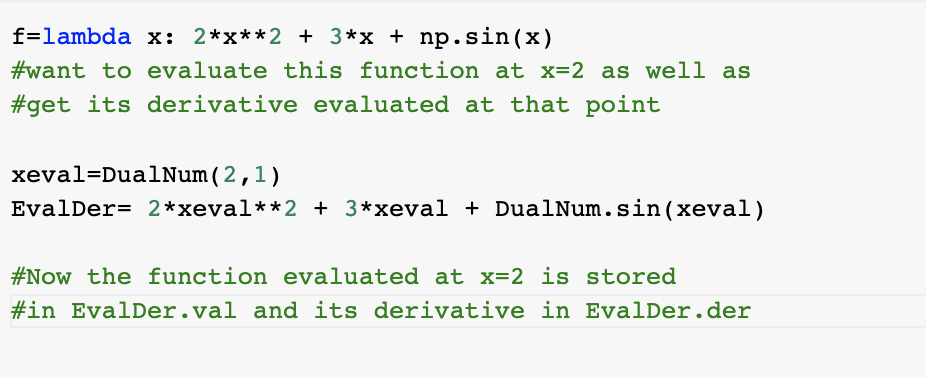

# Introduction

This package implements the automatic differentiation. This is important for complex computational problems, including optimization. 

# Background 

Automatic Differentiation is a set of techniques that executes a sequence of elementary arithmetic operations (addition, subtraction, multiplication, division, etc.) and elementary functions. AD applies the chain rule to these operations to compute derivatives of arbitrary order, which is when the order is a real rational, irrational, or complex number. AD is different from symbolic and numerical differentiation because it is more code efficient, can output a single expression, and does not have round-off errors in the discretization process/cancellation. AD is also popular because it can compute partial derivatives of functions with many inputs/independent variables, which is important for gradient-based optimization. The two forms of AD are the forward mode, where the chain rule is applied from inside to outside the given function/expression, while reverse mode goes from outside to inside.

# How to Use AutomaticDifferentiation(Taro to update)

#### Installing the package

python3 -m pip install AutDiff

#### Dependencies 

python3 -m pip install requirements.txt

#### Importing the package: 

import AutDiff as ad

#### Importing numpy will also be necessary: 

#### Examples:

For a scalar function: 
#### Installing the package

python3 -m pip install AutDiff

#### Dependencies 

python3 -m pip install requirements.txt

#### Importing the package: 

import AutDiff as ad

#### Importing numpy will also be necessary: 

#### Examples:

For a scalar function: 

#### Installing the package

python3 -m pip install AutDiff

#### Dependencies 

python3 -m pip install requirements.txt

#### Importing the package: 

import AutDiff as ad

#### Importing numpy will also be necessary: 

#### Examples:

For a scalar function: 
#### Installing the package

python3 -m pip install AutDiff

#### Dependencies 

python3 -m pip install requirements.txt

#### Importing the package: 

import AutDiff as ad

#### Importing numpy will also be necessary: 

#### Examples:

For a scalar function: 

For a vector function:

# Software Orgnaization(Zach to update: address the milestone 1 requirement 1 by 1. describe what modules you will have,what file contains  what, give a photo with structure,package distribution. need more details)

- All source code along can be put into a /src directory, tests in /tests, and documentation 
in /docs. 
- We will have the module autodiff, which handles automatic differentiation.
- TravisCI and CodeCov will be used for testing.
- Package will be distributed by uploading to PyPI.
- We may or may not package our software using Django.

# Implementation (Jie to update)
# core data structure, classes, method and name attributes, give example
# like dual numbers, forward mode, fast forward mode, what methods are in which
# external dependencies, dealing with elementary functions
# 

1. Core data structure: 
We will primarily use arrays. We will design our own data structure for dual numbers. 

2. Classes to implement: 
We will implement 2 classes: 
- Differentation 
- DualNumber

3. Methods and name attributes: 
Basic methods will include *forward*, *reverse*, *primaltrace*, *tangenttrace*, etc.
Sample method will be executed as the following:

 
4. External dependencies: 
We will likely use **scipy**, **numpy** and **simpy**. 

5. Deal with elementary functions: we will overload those functions. 

# Licensing

MIT License

Copyright (c) [2021] [Jie Sun, Taro Johann Spirig, Zachary Brown, Hannah Phan] 
Permission is hereby granted, free of charge, to any person obtaining a copy
of this software and associated documentation files (the "Software"), to deal
in the Software without restriction, including without limitation the rights
to use, copy, modify, merge, publish, distribute, sublicense, and/or sell
copies of the Software, and to permit persons to whom the Software is
furnished to do so, subject to the following conditions:

The above copyright notice and this permission notice shall be included in all
copies or substantial portions of the Software.

THE SOFTWARE IS PROVIDED "AS IS", WITHOUT WARRANTY OF ANY KIND, EXPRESS OR
IMPLIED, INCLUDING BUT NOT LIMITED TO THE WARRANTIES OF MERCHANTABILITY,
FITNESS FOR A PARTICULAR PURPOSE AND NONINFRINGEMENT. IN NO EVENT SHALL THE
AUTHORS OR COPYRIGHT HOLDERS BE LIABLE FOR ANY CLAIM, DAMAGES OR OTHER
LIABILITY, WHETHER IN AN ACTION OF CONTRACT, TORT OR OTHERWISE, ARISING FROM,
OUT OF OR IN CONNECTION WITH THE SOFTWARE OR THE USE OR OTHER DEALINGS IN THE
SOFTWARE.

# Feedback
More specifically, 
a) in the background section, it will be helpful to add some information about computational graphs and how they are used in AD. 
b) In "how to use" I would add some information about how this package can be downloaded/installed, and some more detailed demo examples of you creating some scalar/vector functions, and getting their values and derivatives. 
c) In implementation details, I would consider some of the elementary functions that you would add (like __add__, sin, __mul__, etc.), and have either a short description for all of them, or some basic pseudocode for one or two of them. 
